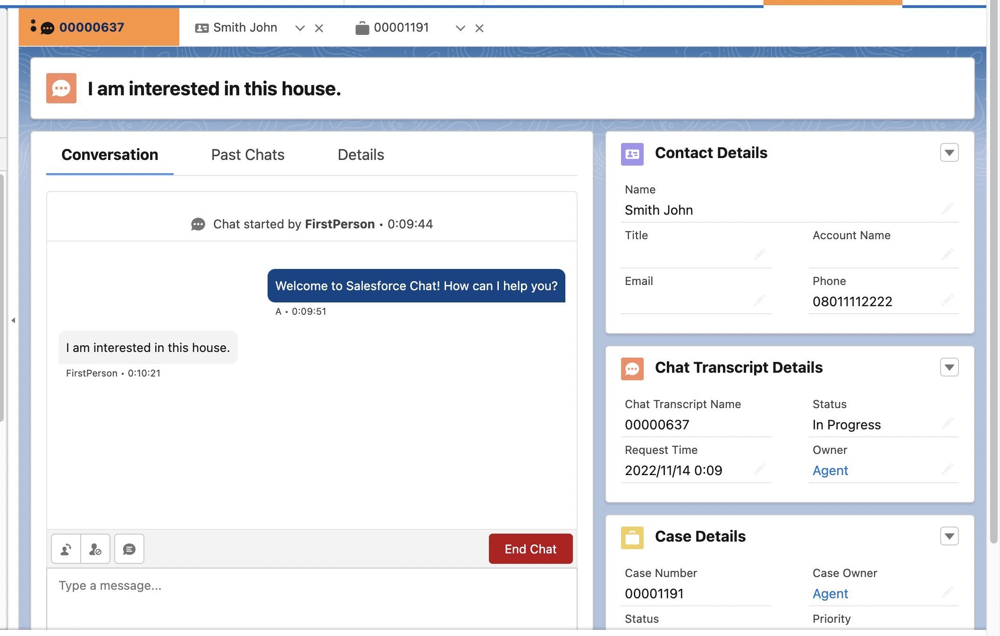

# Salesforce Chat integration with Unity

It also means Salesforce CRM integration with Unity.

(Work in progress)

<table>
    <tr>
        <td>
            
        </td>
        <td>
            
        </td>
    </tr>
    <tr>
        <td>
            Unity
        </td>
        <td>
            Salesforce Service Console
        </td>
    </tr> 
</table>
    
```
    VIRTUAL WORLD                                         REAL WORLD

                                           Objects: LiveChatTranscript, Case, Lead ...
                                                               ^
                                                               |
                                                            Pop up
                                                               |
       Unity ---------- Chat initiation ------------> Salesforce Service Console
     3D Games
     Digital Twin 
     Metaverse

```

## Potential use cases

- Virtual housing exhibition
- Virtual retail stores
- Virtual sightseeing

## Salesforce Chat REST API message sequence diagram

```

  Unity                                 Salesforce Platform

    Initializing a chat session
    |                                            |
    |------- GET System/SessionId -------------->|
    |<------ 200 OK -----------------------------|
    |                                            |
    |------- POST Chasitor/ChasitorInit -------->|
    |<------ 200 OK -----------------------------|
    |                                            |
    
    Sending a message to the agent
    |                                            |
    |------- POST Chasitor/ChatMessage --------->|
    |<------ 200 OK -----------------------------|
    |                                            |
    
    Polling for fetching a message from the agent
    |                                            |
    |------- GET System/Messages --------------->|
    |------- 200 OK -----------------------------|
    |                                            |

```

## Config.cs

"Config.cs" is a config file for this application. However, it is not included in this repo for security/privacy reasons. Create "Config.cs" with the following constants in the "Scripts" folder:

```
using UnityEngine;

public class Config : MonoBehaviour
{
    public const string BASE_URL = "<Salesforce Chat REST server host>/chat/rest/";
    public const string ORGANIZATION_ID = "<your company's organization ID";
    public const string DEPLOYMENT_ID = "<deployment ID>";
    public const string BUTTON_ID = "<button ID>";
    public const string AGENT_ID = "";  // Empty for normal chat
    public const string USER_AGENT = "UnityWebRequest";
    public const string LANGUAGE = "ja-JP";
    public const string SCREEN_RESOLUTION = "2560x1440";
    public const string VISITOR_NAME = "<your name>";

    public const string API_VERSION = "55";
}
```

Refer to [this document](https://developer.salesforce.com/docs/atlas.en-us.noversion.service_sdk_ios.meta/service_sdk_ios/live_agent_cloud_setup_get_settings.htm) to get your chat settings from your organization.

## First Person Character Controller

This app uses [Starter Assets - First Person Character Controller](https://assetstore.unity.com/packages/essentials/starter-assets-first-person-character-controller-196525) to navigate the user in the 3D virtual world.


## Uncheck the Cursor Locked checkbox

Uncheck the checkbox in the yellow circle in the following fig so that a user of this app can enter chat messages in the Input Field:

PlayerCapsule GameObject:


## Tab key as a toggle switch between WASD and uGUI Input Field enablement

Patch: https://github.com/araobp/unity-chat/commit/25ae2f090f98cbf649396e20b6333433528b4852

## Auto-creation of Contact and Case records

It is necessary to send data on your prechat form to the REST API server for auto-creation of Contact and Case records.

In case of REST API client (not prechat form), you need to set "prechatDetails" and "prechatEntities" to ChasitorInit like the following code: [SalesforceChat.cs](./SalesforceChat/Assets/Scripts/SalesforceChat.cs)

Snippet
```
            chasitorInit.prechatDetails.Add(firstName);
            chasitorInit.prechatDetails.Add(lastName);
            chasitorInit.prechatDetails.Add(phone);
            chasitorInit.prechatDetails.Add(subject);
            chasitorInit.prechatEntities.Add(contact);
            chasitorInit.prechatEntities.Add(case_);
```

## Wish list

### Transferring images

Capture a scene with Unity Camera and transfer the image to the Salesforce Live Agent via chat. Unfortunately, Salesforce Chat REST API does not support file transfer at the moment...

### WebRTC integration

Screen sharing between the client and the agent.

## References

- [Chat REST API Developer Guide](https://resources.docs.salesforce.com/240/latest/en-us/sfdc/pdf/chat_rest.pdf)
- [Get Chat Settings from Your Org](https://developer.salesforce.com/docs/atlas.en-us.noversion.service_sdk_ios.meta/service_sdk_ios/live_agent_cloud_setup_get_settings.htm)

